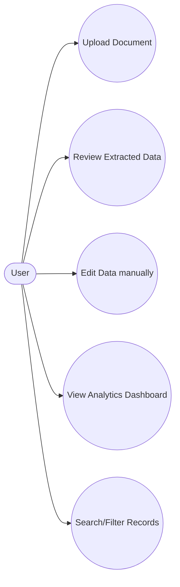
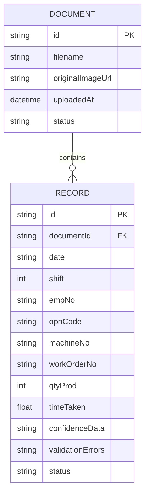
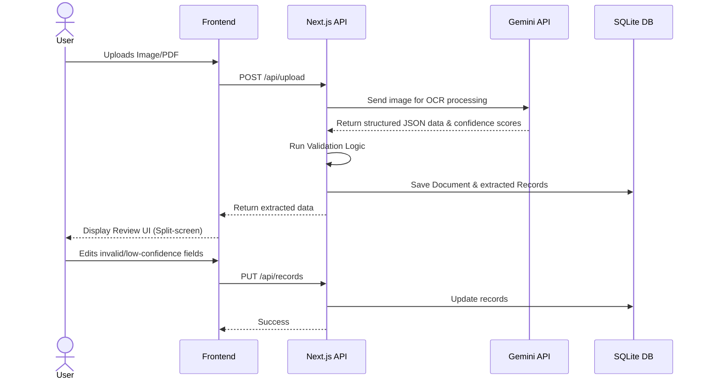
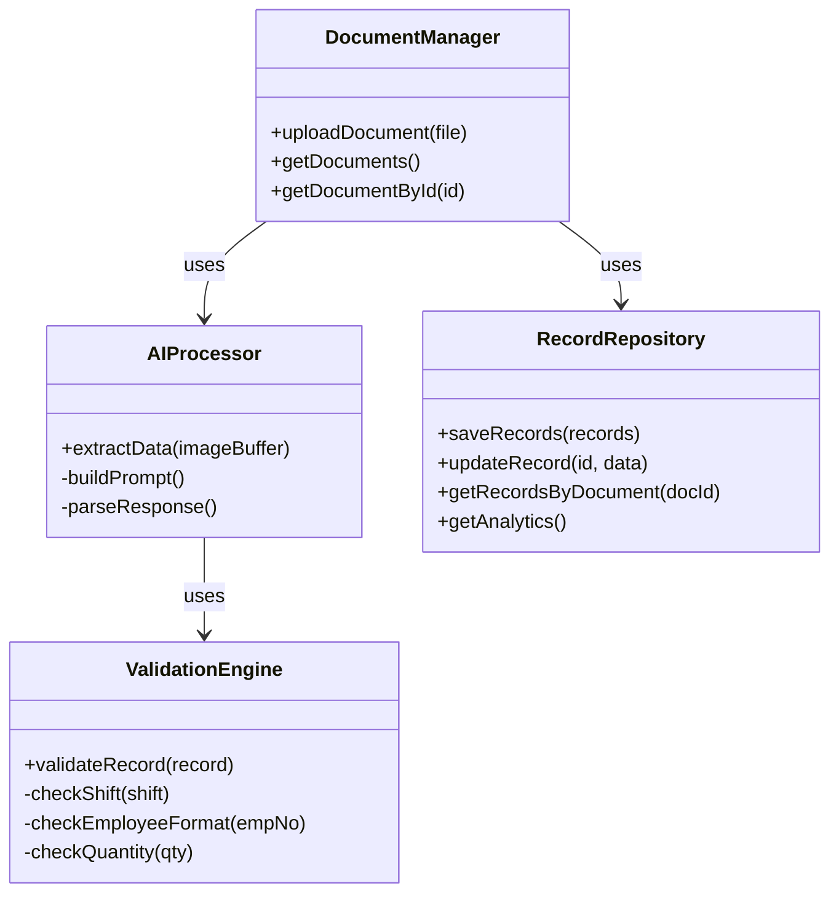
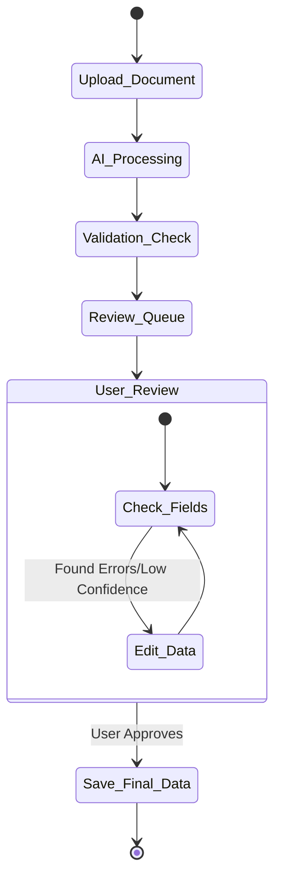

# BiztelAI - AI-Powered Workflow Automation System

A web application prototype built for the BiztelAI Engineering Assignment that digitizes handwritten/semi-structured operational documents and converts them into structured, reviewable operational records with analytics and validation workflows.

## Features

1. **Document Upload**: Users can upload images or PDFs of handwritten operational documents.
2. **AI-Based Data Extraction**: Leverages Google Gemini 2.5 Flash Vision OCR to extract structured information (Date, Shift, Emp No, etc.) and assign confidence scores based on legibility.
3. **Review Workflow**: A split-screen interface displaying the uploaded document alongside an editable data grid for manual correction.
4. **Validation & Exception Handling**: Business rules automatically flag suspicious values (e.g., Time taken > 12 hours, invalid shifts, missing quantities) directly in the UI.
5. **Dashboard & Analytics**: Provides operational insights such as total uploads, shift-wise summaries, and machine-wise output.

## Tech Stack

- **Framework**: Next.js 15 (App Router)
- **Database**: Local SQLite (`better-sqlite3`)
- **AI/LLM**: Google Gemini API (`@google/genai`)
- **Styling**: Vanilla CSS (CSS Modules) with a custom Glassmorphism UI theme.

## Setup Instructions

1. **Clone the repository**
2. **Install dependencies**:
   ```bash
   npm install
   ```
3. **Set up Environment Variables**:
   Create a `.env.local` file in the root directory and add your Gemini API Key:
   ```bash
   GEMINI_API_KEY=your_gemini_api_key_here
   ```
4. **Run the Development Server**:
   ```bash
   npm run dev
   ```
   Navigate to [http://localhost:3000](http://localhost:3000) to view the application. The SQLite database (`biztel.db`) will be automatically initialized on first run.

---

## Architecture & Workflows

Below are the architectural diagrams outlining the system's design and workflows. GitHub natively supports Mermaid diagrams, so these will render automatically.

### 1. Use Case Diagram


### 2. Entity Relationship Diagram (ERD)


### 3. Sequence Diagram (Extraction Workflow)


### 4. Class Diagram (Core Services)


### 5. Activity Diagram

